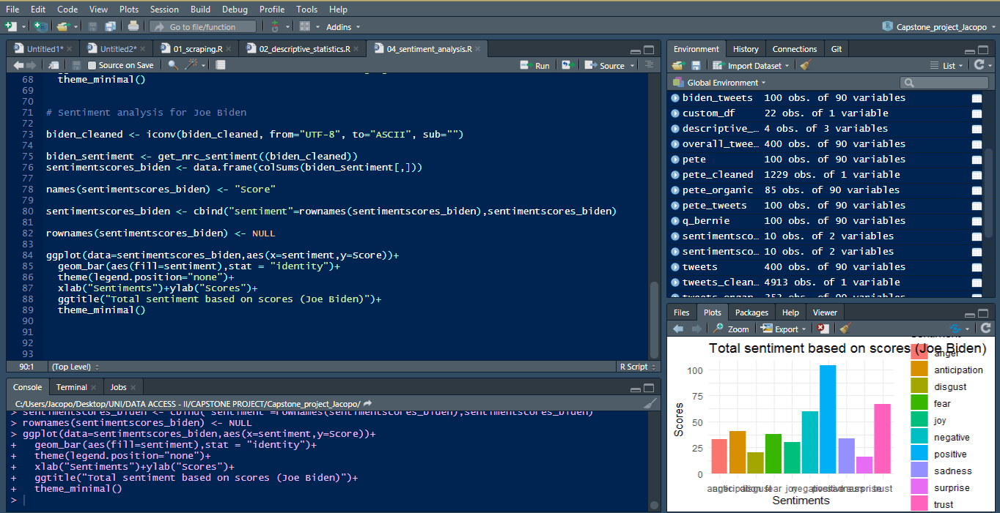

# 2020 Democratic Party presidential primaries:       text and sentiment analysis


<p align="center">
  <a href="#about">About</a> •
  <a href="#features">Features</a> •
  <a href="#prerequisites">Prerequisites</a> •
  <a href="#folders">Folder Structure</a> •
  <a href="#author">Author</a> 
</p>


## About

<table>
<tr>
<td>

You are reading Jacopo Malatesta's capstone project for the <i>Data Access and Regulation</i> course of the <i>Data Analytics for Politics, Society and Complex Organizations</i> Master program (University of Milan). This small research aims at gaining insight into the Twitter content concerning the 2020 Democratic Party presidential primaries. The goal of this research is to analyze Twitter data concerning the four main Democratic candidates in order to highlight the underlying emotion and sentiment beneath their tweets and to shed light on the most frequent topics and issues. The candidates are Bernie Sanders, Elizabeth Warren, Pete Buttigieg and Joe Biden.  


<p align="right">
<sub>(Preview)</sub>
</p>


</td>
</tr>
</table>

## Features 

The overall structure of this work was inspired by Céline Van den Rul’s <a href="https://towardsdatascience.com/a-guide-to-mining-and-analysing-tweets-with-r-2f56818fdd16"> article </a> “A Guide to Mining and Analysing Tweets with R”, which also served as a source of inspiration for many of the lines of codes that were used. This project consists of three separate steps: collecting Twitter data, analyzing the content and sentiment of its text and visualizing the results. The data collection has been carried out by scraping Twitter data with an R studio package called “Rtweet”; the analysis and visualization parts instead required the use of basic text and sentimental analysis tools, such as the syuzhet and tidytext packages. Naturally, more common packages such as rio, dplyr and ggplot2 were used as well throughout the project.

## Prerequisites

The following is a list of packages needed for this project.

```r
install.packages("rtweet")
```

```r
install.packages("tidytext")
```

```r
install.packages("syuzhet")
```

## Folders 

Folder name | Content
------------ | -------------
graphs | Graphs produced in the scripts
images | Images used in the read_me file
junk | Tests 
output | Scraped tweets 
report | Final R Markdown report
src | R scripts

## Author

* **Jacopo Malatesta** - [My GitHub profile](https://github.com/JacopoMalatesta)


