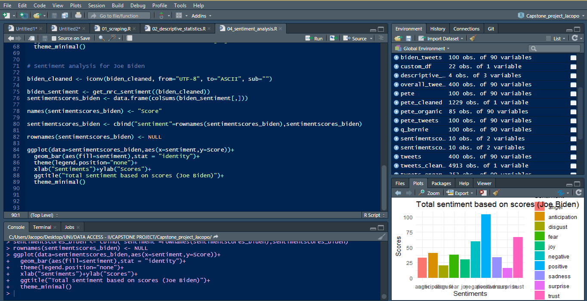

# 2020 Democratic Party presidential primaries:       text and sentiment analysis


<p align="center">
  <a href="#about">About</a> •
  <a href="#goals">Goals</a> •
  <a href="#prerequisites">Prerequisites</a> •
  <a href="#folders">Folder Structure</a> •
  <a href="#author">Author</a> 
</p>


## About

<table>
<tr>
<td>

You are reading Jacopo Malatesta's capstone project for the <i>Data Access and Regulation</i> course of the <i>Data Analytics for Politics, Society and Complex Organizations</i> Master program (University of Milan). This small research aims at gaining insight into the Twitter content regarding the 2020 Democratic Party presidential primaries. In order to achieve this, Twitter data, including both tweets about the candidates and tweets by the candidates, have been scraped and analyzed with basic text analysis and sentimental analysis tools. 


<p align="right">
<sub>(Preview)</sub>
</p>


</td>
</tr>
</table>

## Prerequisites

The following is a list of packages needed for this project.

```r
install.packages("rtweet")
```

```r
install.packages("tidytext")
```

```r
install.packages("syuzhet")
```

## Folders 

Folder name | Content
------------ | -------------
junk | Tests 
output | Scraped tweets 
report | Final R Markdown report
src | R scripts

## Author

* **Jacopo Malatesta** - [My GitHub profile](https://github.com/JacopoMalatesta)


